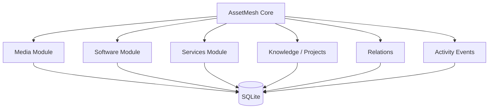

# AssetMesh

> A local-first personal digital asset manager for organizing what you own, use, maintain, and care about — and the relationships between them.

AssetMesh is a personal digital inventory and asset management system. It is designed to unify media records, software, CLI tools, services, knowledge, projects, subscriptions, and other digital assets in one durable, portable system.

The project is **not** primarily a system monitor or control panel. Runtime status, health checks, and actions are optional capabilities attached to assets that can support them. The center of the product is the asset library and the relationships between assets.

## Product principles

- **Local-first** — your canonical data lives locally and remains usable without a cloud service.
- **Asset-centric** — everything starts from durable digital assets, not dashboards or processes.
- **Relationship-aware** — assets can depend on, use, contain, reference, or belong to other assets.
- **Portable by default** — SQLite is operational storage; portable export is part of the product contract.
- **Modular** — media, software, services, knowledge, and future domains are independent modules on a shared core.
- **UI-independent core** — the domain and application layers should be reusable by desktop, CLI, HTTP, or agent adapters.
- **Deterministic first** — AI may assist discovery and enrichment later, but it must not be the source of truth.

## Initial scope

The first vertical slice is **Media Records**. It validates the shared application shell, domain conventions, storage layer, import/export, search/filtering, activity events, and module boundaries before expanding into software and services.



## Planned architecture

```text
AssetMesh
├── apps/
│   ├── desktop/        # future Tauri + React desktop client
│   └── web/            # optional future web client
├── crates/
│   ├── core/           # domain + application services
│   ├── storage-sqlite/ # SQLite adapter
│   ├── providers/      # macOS / metadata / external providers
│   ├── cli/            # headless local interface
│   └── server/         # optional HTTP adapter; not required for V1
├── docs/
└── migrations/
```

The exact code layout may evolve, but one rule should remain stable: **business rules do not depend on Tauri, React, HTTP, or SQLite-specific APIs.**

## Documentation

- [Vision](docs/00-vision.md)
- [Product Design](docs/01-product-design.md)
- [Architecture](docs/02-architecture.md)
- [Domain Model](docs/03-domain-model.md)
- [Foundation Design](docs/04-foundation.md)
- [Storage & Portability](docs/05-storage-and-portability.md)
- [Module System](docs/06-module-system.md)
- [Roadmap](docs/07-roadmap.md)
- [Media Records V1](docs/08-media-records-v1.md)
- [Architecture Decisions](docs/adr/)

## Current status

**Phase 0 — architecture and foundation design.**

No production implementation is committed yet. The next milestone is a thin Media Records vertical slice with import of existing historical data.
