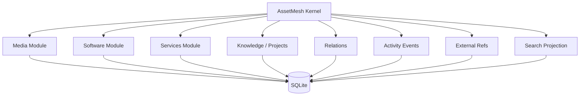

# AssetMesh

> A local-first personal digital asset manager for organizing what you own, use, maintain, and care about — and the relationships between them.

AssetMesh is a personal digital inventory and asset management system. It is designed to unify media records, software, CLI tools, services, knowledge, projects, subscriptions, and other digital assets in one durable, portable system.

The project is **not** primarily a system monitor or control panel. Runtime status, health checks, and actions are optional capabilities attached to assets that can support them. The center of the product is the asset library and the relationships between assets.

## Product principles

- **Local-first** — your canonical data lives locally and remains usable without a cloud service.
- **Asset-centric** — everything starts from durable digital assets, not dashboards or processes.
- **Relationship-aware** — assets can depend on, use, contain, reference, or belong to other assets.
- **Portable by default** — SQLite is operational storage; portable export is part of the product contract.
- **Modular** — media, software, services, knowledge, and future domains are independent modules on a shared core.
- **UI-independent core** — the domain and application layers should be reusable by desktop, CLI, HTTP, or agent adapters.
- **Deterministic first** — AI may assist discovery and enrichment later, but it must not be the source of truth.
- **Rebuildable derived state** — search indexes, provider cache, and discovery snapshots must never become irreplaceable user data.
- **Explicit identity** — AssetMesh owns canonical IDs; external provider IDs are namespaced references and duplicate merges are explicit operations.

## Initial scope

The first vertical slice is **Media Records**. It validates the shared application layer, domain conventions, storage layer, import/export, search/filtering, activity events, external-reference matching, and module boundaries before expanding into software and services.

The roadmap is intentionally **headless-first**: after Media Records, the next milestones expand Software, Services, relations, and unified-library application contracts before the desktop shell is built. This keeps presentation concerns from prematurely defining domain or application boundaries.



## Planned architecture

```text
AssetMesh
├── apps/
│   ├── desktop/        # Phase 5: Tauri + React desktop client
│   └── web/            # optional future web client
├── crates/
│   ├── core/           # kernel + domain modules + application services + ports
│   ├── storage-sqlite/ # SQLite adapter
│   ├── providers/      # macOS / metadata / external providers
│   ├── cli/            # headless local interface
│   └── server/         # optional HTTP/local-service adapter; not required for V1
├── docs/
└── migrations/
```

The exact code layout may evolve, but these rules should remain stable:

- business rules do not depend on Tauri, React, HTTP, or SQLite-specific APIs;
- modules own typed domain details and migrations;
- cross-module relationships use shared Asset identities rather than private-table coupling;
- external IDs do not replace AssetMesh identity;
- search/provider cache are rebuildable projections/cache;
- portable export remains independent from the physical SQLite schema.

## Foundation contracts

The Phase 0/0.5 baseline now defines:

- shared `Asset` identity + module-owned typed details;
- namespaced `AssetExternalRef` aliases;
- explicit asset merge semantics;
- relation registry/inverse semantics;
- rebuildable `SearchDocument` projection;
- SQLite WAL / busy-timeout / short-transaction policy;
- independent DB, portable-export, and module schema versions;
- canonical attachment/blob boundary vs provider/derived cache;
- local-first adapters that can evolve from direct SQLite access to an optional coordinating daemon without rewriting the core.

Deliberately **not** implemented or frozen yet:

- multi-device sync / CRDTs;
- third-party plugin ABI;
- durable background-job architecture;
- external/semantic search infrastructure;
- mandatory localhost backend server.

## Documentation

- [Vision](docs/00-vision.md)
- [Product Design](docs/01-product-design.md)
- [Architecture](docs/02-architecture.md)
- [Domain Model](docs/03-domain-model.md)
- [Foundation Design](docs/04-foundation.md)
- [Storage & Portability](docs/05-storage-and-portability.md)
- [Module System](docs/06-module-system.md)
- [Roadmap](docs/07-roadmap.md)
- [Media Records V1](docs/08-media-records-v1.md)
- [Software Inventory V1](docs/09-software-inventory-v1.md)
- [Services & Subscriptions V1](docs/10-services-subscriptions-v1.md)
- [Unified Library Core — Phase 4](docs/11-unified-library-core.md)
- [Architecture Decisions](docs/adr/README.md)
- [Developer Setup & Implementation Notes](DEVELOPMENT.md)

## Current status

**Phase 3 — Services and Subscriptions, Phase 4 — Unified Library Core (4A–4D), and Phase 5 — Application Shell / Desktop UI through P5-10 are implemented.** The Linux real-window WebDriver gate is configured; its first CI run still needs confirmation.

Phase 4 did not add another asset domain. It turned the existing Media, Software, and Services vertical slices into one stable, transport-neutral application-facing library: unified list/detail/search DTOs, cross-module relation traversal and impact queries with explainable paths, cross-module activity querying, and deterministic review-only duplicate detection. See [docs/11-unified-library-core.md](docs/11-unified-library-core.md).

Phase 5 added a Tauri desktop app in `apps/desktop` alongside the existing CLI, both over the same application layer and without a second set of business rules. Every desktop command calls an application service — the invariant in [CONTRIBUTING.md](CONTRIBUTING.md) — so repository and SQLite reads stay behind the core boundary. The review paths that the UI needed (a merged tombstone, a merge preview) became core use cases for exactly that reason.

```text
AssetMesh/
├── apps/
│   └── desktop/          # Tauri desktop app: src/ React, src-tauri/ Rust adapter
├── crates/
│   ├── core/             # domain + ports + application services (no infra deps)
│   ├── providers/        # discovery adapters: macOS apps, Homebrew, npm/pipx
│   ├── storage-sqlite/   # SQLite adapter: migrations, repositories, FTS5 search
│   └── cli/              # assetmesh binary (thin adapter over application services)
└── migrations/           # checksummed, ordered SQL migrations
```

The frontend gate is separate from the Rust one: `npm test` runs the unit suite in jsdom against a fake transport; `npm run test:frontend-workflow` walks through cross-workspace UI workflows in jsdom. On Linux, `npm run test:e2e` drives the real Tauri window through WebKitGTK and IPC into SQLite via `tauri-driver`. The desktop Rust contracts run separately against real SQLite.

What works today:

- shared `Asset` identity (UUIDv7) with Media, Software, and Services module-owned typed details;
- namespaced `AssetExternalRef` aliases with `UNIQUE(namespace, external_id)` (`bundle_id`, `homebrew_formula`, `homebrew_cask`, `npm`, `pipx`, ...);
- explicit merge with tombstone/redirect (`merged_into`) semantics across Media, Software, and Services, including relation re-pointing; Service conflicts are resolved field-by-field or rejected for review rather than silently choosing a survivor;
- Media CRUD/use cases with status/progress/rating invariants;
- Software CRUD/use cases with category/install-source/location/purpose ("why installed") fields;
- read-only discovery providers — macOS applications, Homebrew, npm/pipx CLI tools — producing advisory candidates that are classified (new / exact match / potential duplicate / conflict) and only become canonical through explicit adoption that never overwrites user-owned purpose/notes;
- a shared relation system (registry with inverse/symmetric semantics: `depends_on`, `uses`, `installed_via`, `hosted_on`, `points_to`, `related_to`); inverse types are view-time derivations, so each fact has exactly one canonical row;
- Services CRUD/use cases for `service.saas`, `service.api`, `service.vps`, `service.domain`, and `service.local`, with subscription plan, integer-minor-unit cost/currency, billing cadence, renewal/expiry, and auto-renew metadata; the canonical vocabulary carries no credential material, and a credential-bearing URL is rejected rather than parsed;
- explicit `record_renewal` for subscriptions — an `service.renewed` activity event records the renewal as historical provenance; the next renewal/expiry boundary is whatever you state, never computed;
- Service-specific merge semantics: equal values deduplicate, empty fields fill, and any still-disagreeing field is a reviewable conflict listing both values rather than a silent survivor pick;
- atomic canonical-write + activity + projection commits (single short SQLite transaction);
- rebuildable FTS5 search projection covering Media, Software, and Services (with CJK/substring fallback);
- **a unified library application contract** — `LibraryService` lists, opens, and searches the whole library through one typed boundary, so an adapter never branches on `asset.kind` to reach a module repository; every unified read runs in a single `QueryUnitOfWork` snapshot with deterministic ordering (`AssetId` tie-breaker) and bounded pagination, and list rows and search hits share one `AssetSummary` vocabulary;
- **bounded relation traversal and impact queries (Phase 4B)** — `RelationQueryService` answers neighbors / dependencies / dependents / traverse / impact over the existing canonical relation rows, with cycle safety, a depth bound, effective (inverse-resolved) relation types, and a shortest-path explanation for every reached node; no graph database and no risk score;
- **cross-module activity querying (Phase 4C)** — `ActivityService` filters and pages the activity log across every module, ordered newest first with an event-id tie-breaker, and keeps the history of archived and merged assets explainable;
- **deterministic duplicate review (Phase 4C)** — `DuplicateReviewService` reports candidate pairs with typed evidence from canonical fields only, bucketed rather than pairwise, review-only: it never merges, never scores, and adds no storage;
- JSON/CSV legacy import with dry-run, matching precedence, and non-merging conflict reports;
- portable export/import with independent DB / export / module-schema versions, round-trip tests, and backward-compatible handling for bundles that predate newer modules;
- migration 0003 verified against a real database written by the Phase 2 binary, so historical Media/Software/Relation data is proven to survive the upgrade; migration 0004 widens the stored relation-type CHECK to the Phase 3 service types (`hosted_on`, `points_to`) while leaving already-applied migrations immutable;
- CLI and desktop exercising the same application layer that future HTTP or agent adapters can call: `assetmesh library list|get|search`, `assetmesh relation neighbors|dependencies|dependents|impact|traverse`, `assetmesh activity list`, and `assetmesh duplicates list` — thin adapters that parse input, build an application query, and format output;
- **a Tauri desktop app over the same application layer** (`apps/desktop`) — library ledger with unified search and filters, per-module creation and mutation flows, relation explorer, activity history, duplicate review with an explicit merge preview, and portable import/export with a mandatory preflight before any mutation; every command goes through an application service, and the merge review never preselects a survivor;
- module list queries load a whole page's tags in one statement rather than one per row, pinned by a query-count contract so a listing does not silently get slower as the library grows.

Services round-trip through the portable bundle via `modules/services.jsonl`: the manifest's `services` declaration is authoritative, so a bundle that predates Phase 3 leaves the destination's services untouched while a section file without its declaration is treated as corruption. Nothing in Phase 3 remains pending.

Run `cargo test --workspace` for Rust contracts, and `npm run typecheck && npm run lint && npm test && npm run test:frontend-workflow && npm run build` for the desktop app. Linux CI additionally builds the Tauri binary and runs `xvfb-run -a npm run test:e2e` against the real window. See [DEVELOPMENT.md](DEVELOPMENT.md) for setup.

Still deliberately absent: HTTP/MCP servers, runtime discovery/monitoring (Phase 6), attachments/blobs (boundary defined by ADR 0009 only), sync, plugins, durable background jobs, and persistent discovery snapshots.
