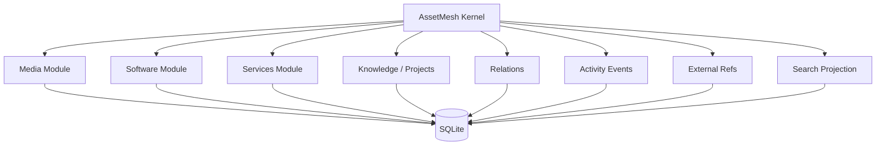

# AssetMesh

> A local-first personal digital asset manager for organizing what you own, use, maintain, and care about — and the relationships between them.

AssetMesh is a personal digital inventory and asset management system. It is designed to unify media records, software, CLI tools, services, knowledge, projects, subscriptions, and other digital assets in one durable, portable system.

The project is **not** primarily a system monitor or control panel. Runtime status, health checks, and actions are optional capabilities attached to assets that can support them. The center of the product is the asset library and the relationships between assets.

## Product principles

- **Local-first** — your canonical data lives locally and remains usable without a cloud service.
- **Asset-centric** — everything starts from durable digital assets, not dashboards or processes.
- **Relationship-aware** — assets can depend on, use, contain, reference, or belong to other assets.
- **Portable by default** — SQLite is operational storage; portable export is part of the product contract.
- **Modular** — media, software, services, knowledge, and future domains are independent modules on a shared core.
- **UI-independent core** — the domain and application layers should be reusable by desktop, CLI, HTTP, or agent adapters.
- **Deterministic first** — AI may assist discovery and enrichment later, but it must not be the source of truth.
- **Rebuildable derived state** — search indexes, provider cache, and discovery snapshots must never become irreplaceable user data.
- **Explicit identity** — AssetMesh owns canonical IDs; external provider IDs are namespaced references and duplicate merges are explicit operations.

## Initial scope

The first vertical slice is **Media Records**. It validates the shared application shell, domain conventions, storage layer, import/export, search/filtering, activity events, external-reference matching, and module boundaries before expanding into software and services.



## Planned architecture

```text
AssetMesh
├── apps/
│   ├── desktop/        # future Tauri + React desktop client
│   └── web/            # optional future web client
├── crates/
│   ├── core/           # kernel + domain modules + application services + ports
│   ├── storage-sqlite/ # SQLite adapter
│   ├── providers/      # macOS / metadata / external providers
│   ├── cli/            # headless local interface
│   └── server/         # optional HTTP/local-service adapter; not required for V1
├── docs/
└── migrations/
```

The exact code layout may evolve, but these rules should remain stable:

- business rules do not depend on Tauri, React, HTTP, or SQLite-specific APIs;
- modules own typed domain details and migrations;
- cross-module relationships use shared Asset identities rather than private-table coupling;
- external IDs do not replace AssetMesh identity;
- search/provider cache are rebuildable projections/cache;
- portable export remains independent from the physical SQLite schema.

## Foundation contracts

The Phase 0/0.5 baseline now defines:

- shared `Asset` identity + module-owned typed details;
- namespaced `AssetExternalRef` aliases;
- explicit asset merge semantics;
- relation registry/inverse semantics;
- rebuildable `SearchDocument` projection;
- SQLite WAL / busy-timeout / short-transaction policy;
- independent DB, portable-export, and module schema versions;
- canonical attachment/blob boundary vs provider/derived cache;
- local-first adapters that can evolve from direct SQLite access to an optional coordinating daemon without rewriting the core.

Deliberately **not** implemented or frozen yet:

- multi-device sync / CRDTs;
- third-party plugin ABI;
- durable background-job architecture;
- external/semantic search infrastructure;
- mandatory localhost backend server.

## Documentation

- [Vision](docs/00-vision.md)
- [Product Design](docs/01-product-design.md)
- [Architecture](docs/02-architecture.md)
- [Domain Model](docs/03-domain-model.md)
- [Foundation Design](docs/04-foundation.md)
- [Storage & Portability](docs/05-storage-and-portability.md)
- [Module System](docs/06-module-system.md)
- [Roadmap](docs/07-roadmap.md)
- [Media Records V1](docs/08-media-records-v1.md)
- [Architecture Decisions](docs/adr/README.md)
- [Developer Setup & Implementation Notes](DEVELOPMENT.md)

## Current status

**Phase 1 — Media Records vertical slice implemented** (headless core, no UI yet).

```text
AssetMesh/
├── crates/
│   ├── core/            # domain + ports + application services (no infra deps)
│   ├── storage-sqlite/  # SQLite adapter: migrations, repositories, FTS5 search
│   └── cli/             # assetmesh binary (thin adapter over application services)
└── migrations/          # checksummed, ordered SQL migrations
```

What works today:

- shared `Asset` identity (UUIDv7) with Media module-owned typed details;
- namespaced `AssetExternalRef` aliases with `UNIQUE(namespace, external_id)`;
- explicit merge with tombstone/redirect (`merged_into`) semantics;
- Media CRUD/use cases with status/progress/rating invariants;
- atomic canonical-write + activity + projection commits (single short SQLite transaction);
- rebuildable FTS5 search projection (with CJK/substring fallback);
- JSON/CSV legacy import with dry-run, matching precedence, and non-merging conflict reports;
- portable export/import with independent DB / export / module-schema versions and round-trip tests;
- CLI exercising the same application layer a future desktop UI will call.

Run `cargo test --workspace` and see [DEVELOPMENT.md](DEVELOPMENT.md) for
setup, commands, and the contracts the implementation established.

Still deliberately absent: desktop/React UI, HTTP/MCP servers, providers and
runtime discovery, attachments/blobs (boundary defined by ADR 0009 only),
tags/collections beyond the shared tag system, sync, plugins, and background
jobs.
