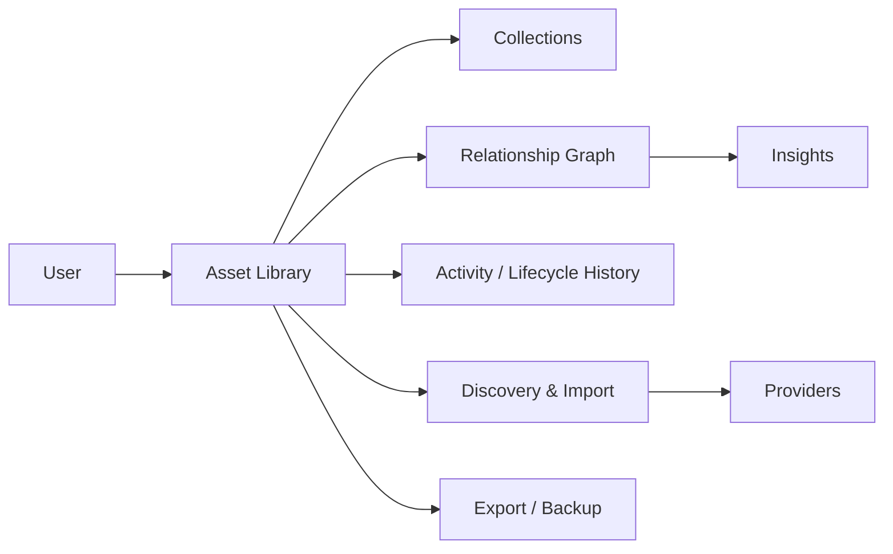

# Vision

## One sentence

AssetMesh is a local-first personal digital asset manager that gives one person a durable inventory of their digital life and makes the relationships between those assets explicit.

## Problem

A modern personal computer is no longer just a folder of documents and installed apps. A single person may own or depend on:

- movies, TV series, anime, games, books, music, and reading/watch/play history;
- desktop applications, CLI tools, runtimes, plugins, extensions, agents, and containers;
- APIs, SaaS products, VPS instances, domains, subscriptions, and local services;
- notes, projects, learning material, repositories, datasets, and other knowledge artifacts.

These assets are spread across applications and storage formats. Their context disappears over time: why something was installed, what depends on it, where its data lives, what subscription pays for it, or which project uses it.

AssetMesh exists to make that inventory durable and understandable.

## What AssetMesh is

AssetMesh is best understood as a **personal digital inventory + relationship graph + lifecycle history**.

The core questions are:

1. What digital assets do I have?
2. Why do I have them?
3. Where did they come from?
4. How are they related?
5. What is their current lifecycle state?
6. What happened to them over time?
7. Can I export and preserve this information independently of the app?

## What AssetMesh is not

AssetMesh is not primarily:

- a CPU/RAM monitoring dashboard;
- a Docker dashboard;
- a macOS cleaner;
- a bookmark manager;
- a media tracker only;
- a second-brain notes app;
- a password manager;
- an AI chat client.

It may integrate with or represent all of those things as assets, but they do not define the product.

## Product shape

## Long-term outcome

Opening AssetMesh should feel like opening an index of one's digital world: media, software, knowledge, services, and projects are all discoverable, searchable, contextualized, and connected.
