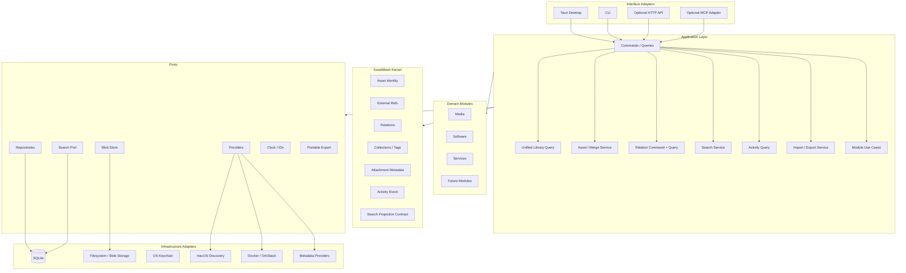

# Architecture

## Architectural goal

Build a reusable headless core first, then attach user interfaces and integrations through adapters.

The system should support a desktop application without forcing all internal calls through an HTTP server. HTTP is an optional future adapter, not the architecture's center.

AssetMesh is best treated as a modular monolith with hexagonal boundaries: one deployable local product may contain many modules, but domain/application rules do not depend on UI frameworks, database drivers, providers, or transport protocols.

## High-level architecture



## The kernel stays small

The shared kernel contains only concepts that multiple modules need consistently:

- stable asset identity;
- namespaced external references;
- relations and relation definitions;
- collections/tags;
- activity-event contract;
- attachment metadata/blob boundary;
- search projection contract;
- import/export primitives where truly shared.

The kernel does **not** know episode semantics, package-manager semantics, API billing semantics, game progress rules, or other module-specific behavior.

Rule of thumb: if a concept only exists because one module needs it, it belongs to that module until another real use case proves it should move inward.

## Layer responsibilities

### Domain modules

Contain business concepts and invariants specific to Media, Software, Services, and future domains. They must not import UI frameworks, database drivers, HTTP frameworks, or Tauri APIs.

### Application

Coordinates use cases, query composition, and transactions. Examples:

- create asset;
- update media progress;
- attach a tag;
- create relation;
- list the unified asset library;
- open a complete typed asset detail view;
- traverse relations and compute dependency/impact views;
- query cross-module activity;
- review duplicate evidence;
- import records;
- explicitly merge duplicate assets;
- produce portable export;
- rebuild/search the shared Search Projection.

Application services decide when provider/discovery output becomes canonical data.

Phase 4 added a stable unified-library query boundary over existing modules, and it is complete: one application surface for list/detail/search, relation traversal and impact, cross-module activity, and duplicate review. That boundary is an application concern, not a new kernel or storage identity model, and Phase 5 Desktop consumes it as-is. See `docs/11-unified-library-core.md`.

### Ports

Interfaces the application depends on, such as repositories, search, providers, blob storage, clock/ID generation, secure-secret references, and portable export.

Repositories remain inward-facing ports. Interface adapters should call application services rather than use repositories directly to assemble cross-module views.

### Infrastructure adapters

Concrete implementations: SQLite, filesystem/blob store, macOS discovery, Docker inspection, metadata APIs, OS keychain, filesystem export.

### Interface adapters

Desktop, CLI, HTTP, or MCP. They translate external input into application commands/queries and application results back to the caller.

Interface adapters do not implement domain decisions such as duplicate matching policy, asset merge semantics, canonical provider promotion, relation traversal semantics, or lifecycle filtering defaults.

## Unified library boundary

Media, Software, and Services own typed module details, but callers should not need to branch into private repositories to build the global library.

Conceptually:

```text
MediaRecord ------\
SoftwareRecord ----> Unified Library Query -> typed AssetSummary / AssetDetailView
ServiceRecord ----/

Shared Asset / Tags / ExternalRefs / Relations / Search / Activity
                         ↑
                         └──────── same read snapshot
```

Important rules:

- canonical `AssetId` remains the primary identity;
- module detail records remain typed rather than becoming unstructured JSON;
- a unified detail query that touches several repositories executes in one read snapshot;
- list/search results share one summary vocabulary instead of defining unrelated UI models;
- normal library pagination and graph traversal must have deterministic ordering;
- interface adapters never query SQLite tables directly to fill missing fields.

## Command / query boundary

Adapters should call stable application use cases rather than arbitrary repositories.

Conceptually:

```text
Command
  create_media
  create_service
  attach_relation
  merge_assets
  resolve_import_conflict

Query
  get_asset
  list_assets
  search_assets
  relation_neighbors
  relation_dependencies
  relation_impact
  recent_activity
  duplicate_candidates
```

The exact code organization does not need full CQRS infrastructure. The purpose is to prevent UI/CLI transports from becoming business-logic owners.

Read-only graph/search/duplicate queries must not repair or mutate canonical data as a side effect. A merge remains an explicit command.

## Rust <-> UI contract

If the desktop client uses React/TypeScript, transport DTOs should be generated or validated from a single source of truth where practical rather than maintained as unrelated handwritten Rust and TypeScript shapes.

Domain types still must not depend on Tauri payload annotations. Adapter DTOs map at the boundary.

The Phase 4 unified-library application DTOs (`AssetSummary`, `AssetDetailView`, `AssetDetails`, `TraversalNode`, `ActivityView`, `DuplicateCandidate`, ...) are the semantic source for Phase 5 transport shapes; SQLite rows are not a UI contract.

## Why no mandatory backend server

A local desktop application should not need a separate localhost server merely to call its own business logic. Keeping the core reusable provides the same portability without introducing unnecessary networking, lifecycle, CORS, or port-management concerns.

If remote access becomes a requirement, an HTTP adapter can be added later without changing domain logic.

## SQLite deployment evolution

V1 may allow Desktop and CLI to access the same local SQLite database through the shared storage adapter.

```text
Desktop -> Core -> SQLite
CLI     -> Core -> SQLite
```

If contention, background work, or remote clients later justify coordination, introduce a local service/daemon:

```text
Desktop ─┐
CLI ─────┼-> Local AssetMesh Service -> Core -> SQLite
HTTP/MCP ┘
```

This is a deployment/adapter evolution, not a replacement architecture. See ADR 0007.

## Relation query architecture

The canonical relation table stores one row per fact. Inverse relation types are view-time semantics, and symmetric relations use canonical endpoint ordering.

The Phase 4 relation query service builds bounded graph views over those canonical rows:

```text
Canonical Relation rows
        ↓
Relation Query Service
        ↓
neighbors / incoming / outgoing
        ↓
bounded dependency traversal
        ↓
impact result with path + depth evidence
```

A graph database is not required. Traversal must be cycle-safe, deterministic, and bounded by application options.

## Search architecture

Modules project canonical data into a shared rebuildable `SearchDocument` representation. Search storage/indexes are infrastructure and may be rebuilt from canonical state.

```text
Module canonical data
      ↓
Search projector
      ↓
SearchDocument
      ↓
SQLite FTS / index
      ↓
SearchPort
      ↓
Unified application summary DTO
```

Structured filters and lifecycle rules remain application behavior. Search does not replace typed filtering or become a second identity source.

See ADR 0006.

## Providers and discovery

Providers return candidates/enrichment. They do not write canonical data directly.

```text
Provider
  ↓
Candidate + external refs
  ↓
Normalize / match
  ↓
Suggestion / import decision
  ↓
Application command
  ↓
Canonical write
```

This preserves deterministic ownership and keeps provider churn outside the domain model.

Duplicate review follows the same principle: detection/evidence is advisory, while canonical merge is explicit.

## Background work

Long-running provider scans, reindexing, thumbnail generation, and large imports may eventually need background jobs.

Do not make a job queue part of the required V1 architecture. Introduce a `JobRunner`/durable job model only when the first real long-running workflow needs it. External queue infrastructure is not justified for the initial local-first product.

## Technology direction

Recommended direction, not yet a hard dependency:

- Core: Rust
- Operational storage: SQLite
- Desktop: Tauri 2 + React + TypeScript
- CLI: Rust binary sharing the same application services
- Graph UI: React Flow or equivalent
- Query state: TanStack Query in the desktop/web UI
- Local search: SQLite indexed fields + FTS5, with trigram/sub-string strategy where needed
- Secrets: OS keychain/secure store

## Dependency rule

Dependencies point inward:

```text
UI / CLI / HTTP / MCP
          ↓
      Application
          ↓
 Domain modules + Kernel
          ↓
         Ports

Infrastructure implements ports defined inward.
```

No domain type should depend on Tauri command payloads or SQL row structures.

No module may reach into another module's private tables to implement cross-module behavior.

No interface adapter may compensate for a missing unified-library application contract by joining repositories or SQLite tables itself.

## Architecture guardrails

1. **Canonical data is deterministic.** AI/discovery may suggest; application rules decide writes.
2. **Search is disposable.** Deleting an index must not delete the library.
3. **Provider cache is disposable.** Deleting cache must not delete canonical attachments.
4. **External IDs are aliases.** AssetMesh owns primary identity.
5. **Transactions stay short.** No external I/O while holding write locks.
6. **Portable export is a product contract.** SQLite layout is not the user's only representation.
7. **Do not freeze speculative extension points.** Prove first-party needs before plugin ABI design.
8. **Unified reads are application behavior.** Adapters do not own cross-module joins or graph semantics.
9. **Graph queries are bounded and explainable.** No hidden risk/confidence score is required to answer impact questions.
10. **Presentation stays outside the core.** Desktop navigation, graph coordinates, and React state are not domain/application concepts.
11. **Mutations enforce optimistic concurrency.** All mutation commands accept `expected_revision`; stale revisions abort immediately with `AppError::StaleRevision` without silent overwrites.
12. **Adapters enforce closed error models.** IPC and transport boundaries serialize into a closed, typed error taxonomy (`DesktopErrorCategory`) preventing secret, credential, or SQL leakage.
13. **Unified library queries push pagination to storage.** Large-library reading uses storage-backed SQL `LIMIT/OFFSET` and two-stage counts for constant memory usage, while batch queries chunk parameters (`<= 500`).
14. **Command registration is single-sourced.** Tauri builder configuration uses `configure_builder` with automated contract verification preventing frontend-backend IPC drift.
