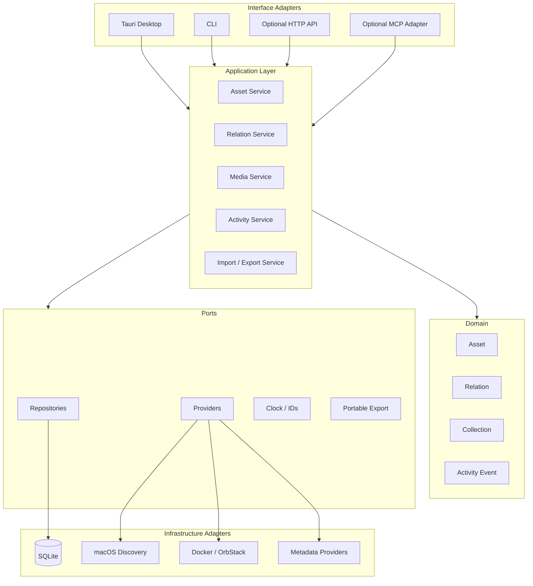

# Architecture

## Architectural goal

Build a reusable headless core first, then attach user interfaces and integrations through adapters.

The system should support a desktop application without forcing all internal calls through an HTTP server. HTTP is an optional future adapter, not the architecture's center.

## High-level architecture



## Layer responsibilities

### Domain

Contains business concepts and invariants. It must not import UI frameworks, database drivers, HTTP frameworks, or Tauri APIs.

### Application

Coordinates use cases and transactions. Examples:

- create asset;
- update media progress;
- attach a tag;
- create relation;
- import records;
- produce portable export;
- record activity event.

### Ports

Interfaces the application depends on, such as repositories and provider contracts.

### Infrastructure adapters

Concrete implementations: SQLite, macOS discovery, Docker inspection, metadata APIs, filesystem export.

### Interface adapters

Desktop, CLI, HTTP, or MCP. They translate external input into application commands and application results back to the caller.

## Why no mandatory backend server

A local desktop application should not need a separate localhost server merely to call its own business logic. Keeping the core reusable provides the same portability without introducing unnecessary networking, lifecycle, CORS, or port-management concerns.

If remote access becomes a requirement, an HTTP adapter can be added later without changing domain logic.

## Technology direction

Recommended direction, not yet a hard dependency:

- Core: Rust
- Operational storage: SQLite
- Desktop: Tauri 2 + React + TypeScript
- CLI: Rust binary sharing the same application services
- Graph UI: React Flow or equivalent
- Query state: TanStack Query in the desktop/web UI

## Dependency rule

Dependencies point inward:

```text
UI / CLI / HTTP
       ↓
Application
       ↓
Domain

Infrastructure implements ports defined inward.
```

No domain type should depend on Tauri command payloads or SQL row structures.
