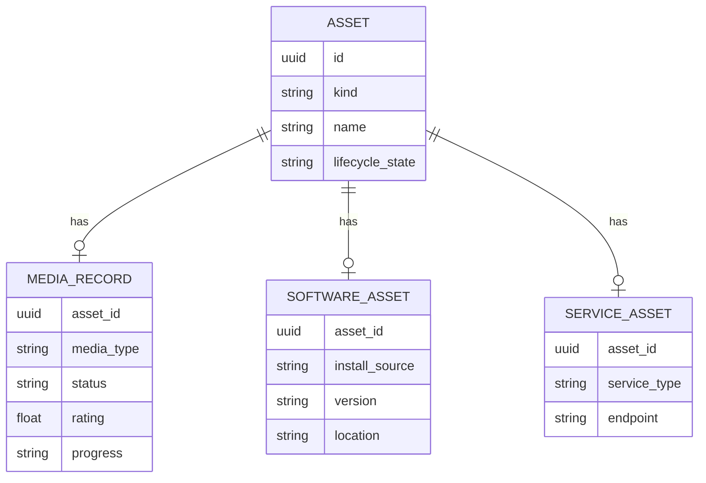

# Domain Model

## Guiding rule

Do not force every domain into one giant universal record. Keep a small shared Asset identity and allow modules to own typed details.

The long-term rule is: **unify identity, not domain semantics**.

## Asset

Suggested shared fields:

```text
Asset
- id
- kind
- name
- summary?
- lifecycle_state
- created_at
- updated_at
- archived_at?
- merged_into_asset_id?
- revision?
```

`kind` identifies the owning module/type, for example:

```text
media.movie
media.anime
media.game
software.app
software.cli
service.api
service.saas
project.git
knowledge.collection
```

The base table should not contain fields such as `episode_count`, `binary_path`, or `endpoint_url`. Those belong to module-owned details.

`revision` is reserved as a simple local optimistic-concurrency/evolution primitive. It does not imply sync or CRDT support in V1.

`merged_into_asset_id` may be used to preserve identity after an explicit merge instead of immediately hard-deleting the losing asset. See ADR 0005.

## Typed details

Example:



Module-specific records are typed details of the shared asset identity, not independent competing top-level identities.

## External references and aliases

External systems provide useful stable identifiers, but they never become AssetMesh primary keys.

```text
AssetExternalRef
- id
- asset_id
- namespace
- external_id
- source_url?
- metadata?
- created_at
- updated_at
```

Examples:

```text
steam:1091500
igdb:1877
bundle_id:com.microsoft.VSCode
homebrew_cask:visual-studio-code
github_repo:dyxnb22/AssetMesh
```

The pair `(namespace, external_id)` should be unique.

External refs are used for reliable repeat imports/discovery before falling back to heuristic matching. See ADR 0005.

## Asset merge

Two canonical assets are never silently merged because their names look similar.

A merge is an explicit application use case with one surviving asset. Module-owned details resolve conflicts through the owning module; shared relations, tags, collections, external refs, attachments, and activity provenance are moved or deduplicated atomically where practical.

The losing identity should remain explainable through a redirect/tombstone mechanism rather than disappearing without history.

## Relation

Relations connect assets without requiring module-to-module hard dependencies.

```text
Relation
- id
- source_asset_id
- target_asset_id
- relation_type
- note?
- created_at
- source   # manual / discovered / imported
- confidence?  # only for suggestions; confirmed relations are canonical
```

Candidate relation types:

- `uses`
- `depends_on`
- `runs_on`
- `hosted_by`
- `belongs_to`
- `part_of`
- `related_to`
- `syncs_with`
- `provided_by`
- `installed_via`

Do not create dozens of relation types before real use cases require them.

### Relation registry

Relation semantics should be defined in code through a small registry rather than by unconstrained UI strings.

Conceptually:

```text
RelationDefinition
- type
- inverse_type?
- symmetric
- allowed_source_kinds?   # optional, only when useful
- allowed_target_kinds?   # optional, only when useful
```

Examples:

```text
depends_on <-> dependency_of
installed_via <-> installs
related_to <-> related_to   # symmetric
```

The registry lets the UI render reverse relationships consistently without duplicating canonical rows solely to represent the inverse direction.

## Collection

Collections are user-curated groupings, independent of asset kind.

Examples:

- “Roleplay stack”
- “AI development”
- “2026 anime”
- “Java interview prep”
- “Services I pay for”

```text
Collection
- id
- name
- description?
- created_at
- updated_at

CollectionMember
- collection_id
- asset_id
- position?
```

## Tags

Tags are lightweight labels. They should not replace typed fields or relations.

## Attachment

Canonical attachments are durable user-owned files associated with assets. Their metadata is shared infrastructure, while the binary content is stored through a blob abstraction.

```text
Attachment
- id
- asset_id
- blob_id
- role
- filename
- mime_type
- size
- created_at
```

Provider downloads and derived thumbnails are caches unless explicitly promoted to canonical attachments. See ADR 0009.

## Search document

`SearchDocument` is a derived projection, not canonical domain state.

```text
SearchDocument
- asset_id
- kind
- title
- subtitle?
- body?
- keywords[]
- updated_at
```

Each module projects its typed data into this common representation for global search. The projection may be rebuilt from canonical state. See ADR 0006.

## Activity event

Activity is an append-oriented history of meaningful events.

```text
ActivityEvent
- id
- occurred_at
- event_type
- asset_id?
- actor
- payload
```

Examples:

- `media.started`
- `media.completed`
- `asset.created`
- `asset.archived`
- `asset.merged`
- `relation.created`
- `software.installed`

Activity events are not intended to be a full event-sourcing architecture in V1. Canonical state remains in normal tables.

## Record vs Asset

Module-specific “records” such as `MediaRecord` are typed details of an Asset, not separate top-level identities competing with the Asset model.

This lets a media title participate in collections, tags, relations, activity, search, attachments, external references, and export using shared infrastructure while keeping media-specific business rules isolated.
