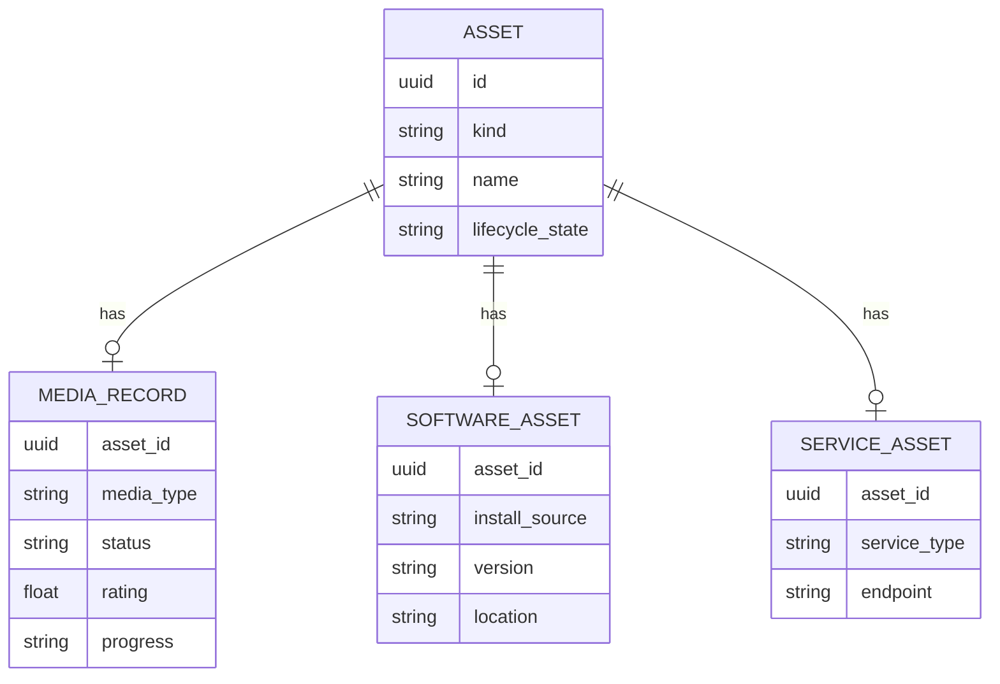

# Domain Model

## Guiding rule

Do not force every domain into one giant universal record. Keep a small shared Asset identity and allow modules to own typed details.

## Asset

Suggested shared fields:

```text
Asset
- id
- kind
- name
- summary?
- lifecycle_state
- created_at
- updated_at
- archived_at?
- metadata_version
```

`kind` identifies the owning module/type, for example:

```text
media.movie
media.anime
media.game
software.app
software.cli
service.api
service.saas
project.git
knowledge.collection
```

The base table should not contain fields such as `episode_count`, `binary_path`, or `endpoint_url`. Those belong to module-owned details.

## Typed details

Example:



## Relation

Relations connect assets without requiring module-to-module hard dependencies.

```text
Relation
- id
- source_asset_id
- target_asset_id
- relation_type
- note?
- created_at
- source   # manual / discovered / imported
- confidence?  # only for suggestions; confirmed relations are canonical
```

Candidate relation types:

- `uses`
- `depends_on`
- `runs_on`
- `hosted_by`
- `belongs_to`
- `part_of`
- `related_to`
- `syncs_with`
- `provided_by`
- `consumed_by`
- `installed_via`

Do not create dozens of relation types before real use cases require them.

## Collection

Collections are user-curated groupings, independent of asset kind.

Examples:

- “Roleplay stack”
- “AI development”
- “2026 anime”
- “Java interview prep”
- “Services I pay for”

```text
Collection
- id
- name
- description?
- created_at
- updated_at

CollectionMember
- collection_id
- asset_id
- position?
```

## Tags

Tags are lightweight labels. They should not replace typed fields or relations.

## Activity event

Activity is an append-oriented history of meaningful events.

```text
ActivityEvent
- id
- occurred_at
- event_type
- asset_id?
- actor
- payload
```

Examples:

- `media.started`
- `media.completed`
- `asset.created`
- `asset.archived`
- `relation.created`
- `software.installed`

Activity events are not intended to be a full event-sourcing architecture in V1. Canonical state remains in normal tables.

## Record vs Asset

Module-specific “records” such as `MediaRecord` are typed details of an Asset, not separate top-level identities competing with the Asset model.

This lets a media title participate in collections, tags, relations, activity, search, and export using shared infrastructure while keeping media-specific business rules isolated.
