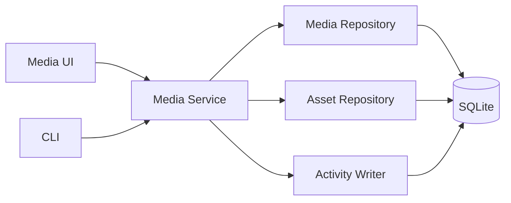

# Module System

## Goal

Modules add domain behavior while reusing the shared asset foundation.

The module system should begin as a **compile-time internal modular architecture**, not a third-party plugin marketplace.

## Module responsibilities

A module may provide:

- asset kinds;
- typed detail schemas;
- validation rules;
- application services;
- importers/exporters;
- search projections;
- UI routes/components;
- provider integrations;
- domain-specific actions.

## Shared services modules can use

- Asset repository
- Relation repository
- Collection/tag services
- Activity writer
- Transaction boundary
- Import/export framework
- Search indexing
- Provider registry

## Example: Media module



## Provider design

Providers enrich or discover; they do not own canonical user data.

Example interfaces:

```text
MediaMetadataProvider
- search(query)
- fetch(external_id)

SoftwareDiscoveryProvider
- scan()
- inspect(candidate)

RuntimeStatusProvider
- status(asset)
```

The application decides whether provider output becomes canonical data.

## Discovery lifecycle

```text
provider scan
    ↓
candidate
    ↓
normalize
    ↓
match existing asset
    ↓
suggest create/update/relation
    ↓
user confirms or policy accepts
    ↓
canonical write
```

This prevents discovery heuristics from silently rewriting the user's inventory.

## Third-party plugins

Do not build third-party dynamic plugins in V1.

First prove at least three first-party modules with different needs:

1. Media Records
2. Software Inventory
3. Services / Subscriptions

Only then evaluate whether an external plugin ABI/API is justified.
