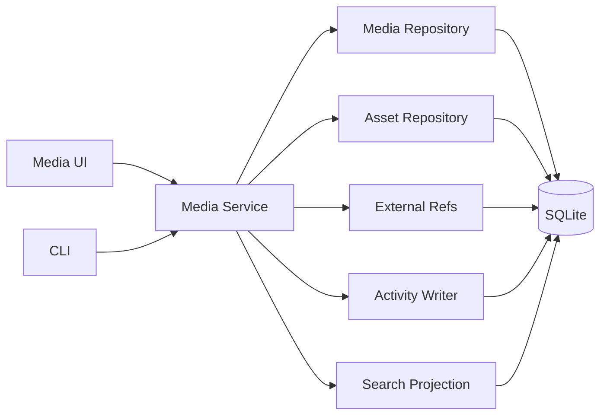

# Module System

## Goal

Modules add domain behavior while reusing the shared asset foundation.

The module system should begin as a **compile-time internal modular architecture**, not a third-party plugin marketplace.

A module owns its domain semantics. The AssetMesh kernel owns only shared identity and cross-cutting capabilities that have proven useful across modules.

## Module responsibilities

A module may provide:

- asset kinds;
- typed detail schemas;
- validation rules;
- application services;
- importers/exporters;
- module schema version and migrations;
- search projection builders;
- UI routes/components;
- provider integrations;
- domain-specific actions;
- merge/conflict-resolution rules for its typed details.

## Shared services modules can use

- Asset repository
- External reference repository
- Relation repository + relation registry
- Collection/tag services
- Activity writer
- Transaction boundary
- Import/export framework
- Search indexing/projection framework
- Attachment/blob contracts
- Provider registry
- Clock / ID generation

## Example: Media module



## Module descriptor

A module should expose a small internal descriptor/registration contract rather than relying on global `if module == ...` branching everywhere.

Conceptually:

```text
ModuleDescriptor
- module_id
- current_schema_version
- asset_kinds
- migrations/import compatibility
- search projector
- optional UI registrations
- optional providers
```

The exact Rust trait/API should remain minimal until Media, Software, and Services reveal the real common denominator.

Do not design a stable third-party ABI from this internal descriptor in V1.

## Schema ownership

Each module owns the semantic version of its typed data and portable representation.

Distinguish:

```text
SQLite database migration version
!= portable export format version
!= module schema version
```

A module must not directly mutate another module's private tables. Cross-module behavior goes through shared core contracts or an explicit coordinated migration.

See ADR 0008.

## Search projection

Each searchable module projects canonical data into the shared search representation:

```text
SearchDocument
- asset_id
- kind
- title
- subtitle?
- body?
- keywords[]
- updated_at
```

Modules decide which of their typed fields, aliases, notes, and external references are meaningful for search. The UI does not need to know module table layouts to perform global search.

The search index is derived/rebuildable and must never become canonical storage.

See ADR 0006.

## Provider design

Providers enrich or discover; they do not own canonical user data.

Example interfaces:

```text
MediaMetadataProvider
- search(query)
- fetch(external_id)

SoftwareDiscoveryProvider
- scan()
- inspect(candidate)

RuntimeStatusProvider
- status(asset)
```

Provider results should include namespaced external identifiers whenever possible so candidates can be matched deterministically against existing assets.

The application decides whether provider output becomes canonical data.

## Discovery lifecycle

```text
provider scan
    ↓
candidate
    ↓
normalize + extract external refs
    ↓
match existing asset
    ├─ exact AssetMesh ID
    ├─ exact external-ref match
    ├─ deterministic module key
    └─ heuristic suggestion
    ↓
suggest create/update/relation/merge review
    ↓
user confirms or explicit policy accepts
    ↓
canonical write
```

Heuristic discovery may suggest a merge but may not silently merge canonical assets.

This prevents discovery heuristics from silently rewriting the user's inventory.

## Attachment behavior

Modules may attach durable user files through the shared attachment/blob system. They should not invent private canonical file stores.

Provider-downloaded or derived media remains cache by default. Explicit user promotion converts it into canonical attachment data.

See ADR 0009.

## Module-to-module relationships

Modules should not import each other's internal repositories merely to express relationships.

Example:

```text
Software asset ── uses ──> Service asset
Media asset ── played_on ──> Software/platform asset
Project asset ── deployed_to ──> Service/VPS asset
```

These are expressed through shared asset IDs and the relation system. If a use case requires behavior from another module, it should use an application-level contract rather than private table access.

## Third-party plugins

Do not build third-party dynamic plugins in V1.

First prove at least three first-party modules with different needs:

1. Media Records
2. Software Inventory
3. Services / Subscriptions

Only then evaluate whether an external plugin ABI/API is justified.

A future plugin system must be designed from proven module contracts, not by freezing today's speculative abstractions.
